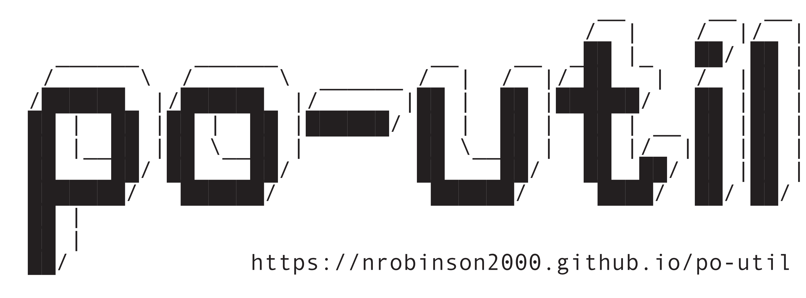

[](https://travis-ci.org/nrobinson2000/homebrew-po)

# [Particle Offline Utility:](https://github.com/nrobinson2000/po-util) The Ultimate Local Particle Experience for Linux and macOS - [Homebrew Edition](https://github.com/nrobinson2000/homebrew-po)

<p align="center">

</p>

# Install

```
$ brew tap nrobinson2000/po
$ brew install po
$ po install
```

# Why use the Homebrew Edition of po-util?

The Homebrew Edition of po-util makes installing and using po-util much cleaner. It doesn't rely on bash aliases, it has releases, and is more stable.

Note: Both versions of po-util have the same features. In December 2016, Homebrew Edition was forked from po-util in order to allow po-util to be installed with Homebrew. The original po-util was renamed to Classic, and was made Linux exclusive. Both Classic and Homebrew Edition continue to be developed and maintained in parallel.

# [Starter Guide](https://github.com/nrobinson2000/po-util/wiki/macOS-Guide)

The starter guide on the po-util Wiki has instructions for setting up po-util, updating device firmware and using po-util.

# Praise for po-util
<blockquote style="background:#22282d"><p>"I think you identified a common pain point for a lot of users, and the automated installation of the Particle toolchain is a problem that we've been focused on a lot recently ... you should already feel proud of yourself because you have made a meaningful contribution to the community. We are all very thankful for it - our community regularly impresses us, and you are certainly not an exception."</p>
<p style="text-align: left"><a href="http://nrobinson2000.me/po-util-recognition.pdf">Will Hart, Particle General Manager</a></p></blockquote>
<hr>

<blockquote style="background:#22282d"><p>"It has been nearly flawless and a HUGE productivity booster... I cannot believe your steps worked installing so many utils and dependencies perfectly... The Particle world owes you a big debt. If there were Emmy awards for Particle contribs, you would get one."</p>
<p style="text-align: left"><a href="http://community.particle.io/t/moving-project-from-web-ide-to-particle-dev-on-a-mac/28398/5?u=nrobinson2000">Andrew Ward, Particle Community Member</a></p></blockquote>
<hr>

<blockquote style="background:#22282d"><p>"Nice! This is great stuff. Definitely helpful for the local dev / offline use case.
Thanks for sharing."</p>
<p style="text-align: left"><a href="http://community.particle.io/t/po-util-a-toolchain-installer-helper-for-linux-and-osx/21015/2?u=nrobinson2000">Avidan Ross, Particle Investor</a></p></blockquote>
<hr>

<blockquote style="background:#22282d"><p>"Thanks a lot for this amazing tool. I finally managed to get everything as I wanted: to be able to work off-line."</p>
<p style="text-align: left"><a href="https://community.particle.io/t/po-util-a-toolchain-installer-helper-for-linux-and-osx/21015/34?u=nrobinson2000">Yannick, Particle Community Member</a></p></blockquote>
<hr>

<blockquote style="background:#22282d"><p>"Po-util is a very handy script - thanks for sharing."</p>
<p style="text-align: left"><a href="http://community.particle.io/t/po-util-a-toolchain-installer-helper-for-linux-and-osx/21015/15?u=nrobinson2000">H.S, Particle Community Member</a></p></blockquote>
<hr>

<blockquote style="background:#22282d"><p>"I can't heart this enough!"</p>
<p style="text-align: left"><a href="http://community.particle.io/t/po-util-a-toolchain-installer-helper-for-linux-and-osx/21015/27?u=nrobinson2000">Josh Fisher, Particle Community Member</a></p></blockquote>
